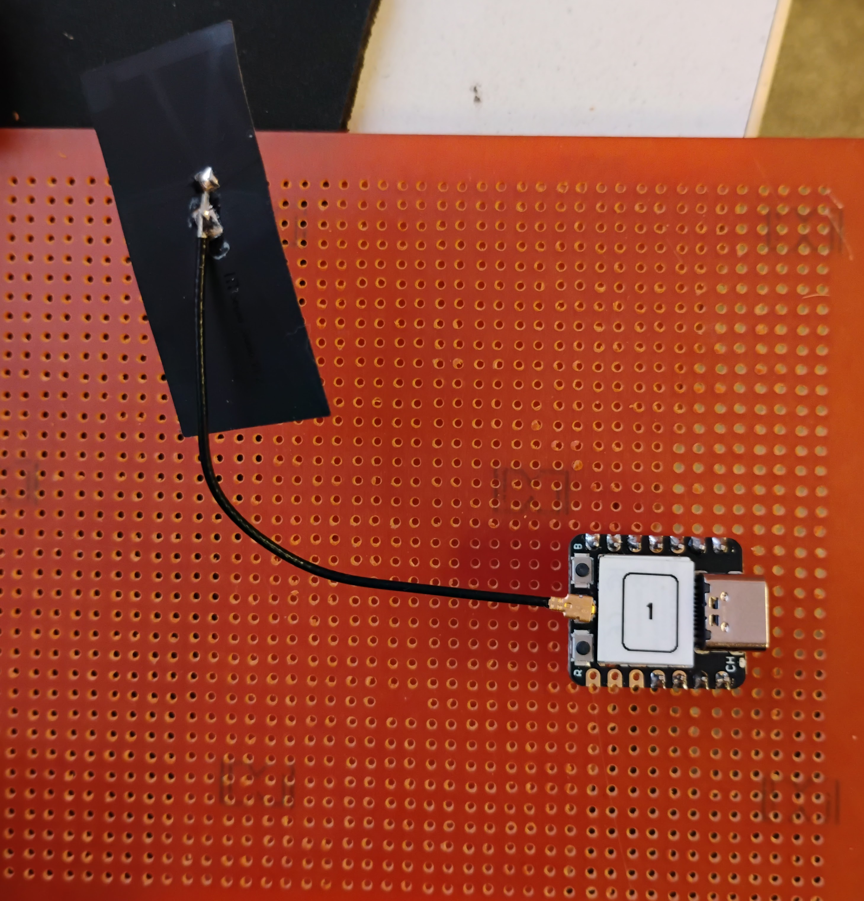
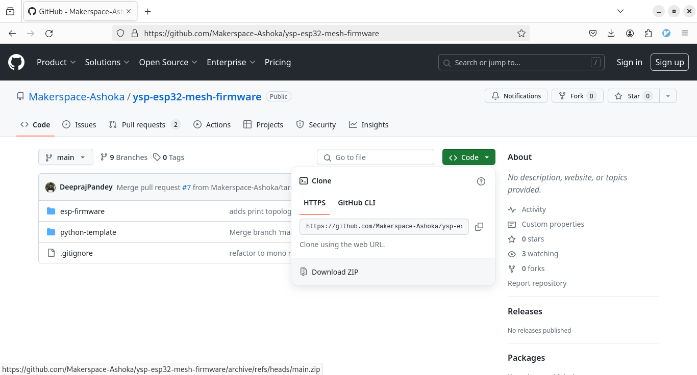
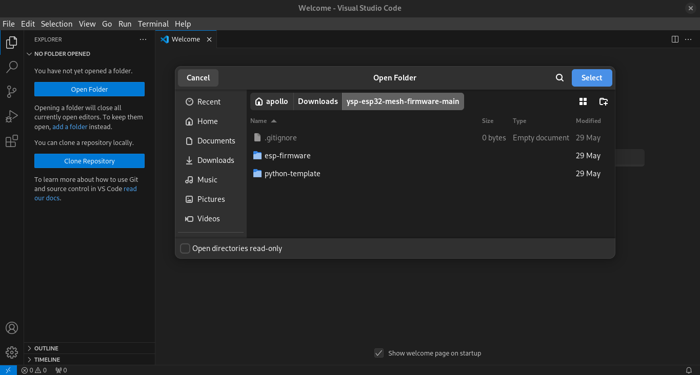
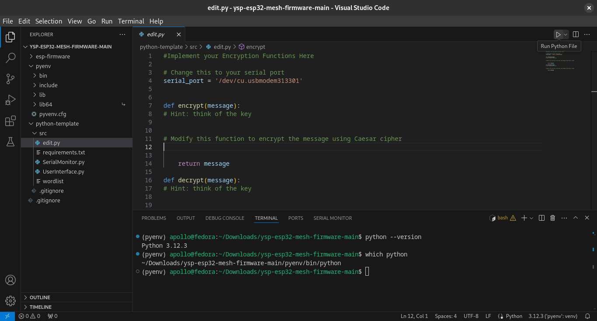

**Estimated Time**: $30$ minutes

# Hardware and Software Requirements

You will be working in pairs, so make sure each pair has all the
hardware and software listed below.

- [x] ESP32 with IDs



- [x] A working Laptop with Windows/Mac/Linux

- [x] Python (version 3.4+)

- [x] USB A-C Cable with IDs

- [x] LED strip

## Installing Python

If you do not have python installed in your device, you can download and
install the official python installer. Follow this [
link](https://www.python.org/downloads/) to install official Python on
your Operating System (Windows, MacOS, Linux).

You can also access the tutorials for your operating system (OS):

### MacOS

1.  Install Homebrew, the package manager for MacOS, using the following command in your terminal (See this [link](https://brew.sh/)).

		/bin/bash -c "$(curl -fsSL https://raw.githubusercontent.com/Homebrew/install/HEAD/install.sh)"

2.  Install python using `brew`.

                brew install python

### Windows

Follow the tutorial in this [link](https://www.digitalocean.com/community/tutorials/install-python-windows-10) to install python in Windows. Make sure you select the checkbox **Add python.exe to PATH** to access python from the command line.

### Linux

Python should be preinstalled in most Linux distributions. If not
available, you can use package manager (apt, dnf) to install it.

## Programs

As you will be only required to write codes for encryption and
decryption (the TAs will guide you on this), we have codes for
interfacing the ESPs in the network. Follow the steps to download the
code.

1.  Go to [https://github.com/Makerspace-Ashoka/ysp-esp32-mesh-firmware](https://github.com/Makerspace-Ashoka/ysp-esp32-mesh-firmware) and download the .zip file.
	
	

2.  (**Important**) Extract the .zip file.

3.  Your directory structure will look like this.
```
|-- ysp-esp32-firmware-main
	|-- assets
 	|-- esp-firmware
  	|-- python-template
	  	|-- src
      	|-- lib
      	|-- requirements.txt
     	|-- workspace.py
```

 You only need to change the `workspace.py` file in this workshop.

## Installing VS Code

We recommend installing VS Code as a text editor. Go to the [VS Code website](https://code.visualstudio.com/) to download and install the
latest version. You can find specific instructions for your OS in the
[documentation](https://code.visualstudio.com/docs/setup/setup-overview).

1.  Launch VS Code and use `Open Folder` to load the
    `ysp-esp32-mesh-firmware` directory.
	
	

    You should be able to see your folder structure on the left panel.

2.  Launch Terminal inside VS Code using `` Ctrl + ` `` . We will now create a python virtual environment to run the code. Follow the [README.md](https://github.com/Makerspace-Ashoka/ysp-esp32-mesh-firmware/blob/main/README.md) on how to create a virtual environment and install the required packages `pyserial` and `colorama`.

When you open a python file (.py), VS Code will ask you to install the Python extension. Install the extension as recommended.

You should now be able to run your code using the Run button in VS Code (see image below for reference).



To make sure you are running the python environment just created
(`.venv`), you can see the bottom-right corner in VS Code, which says the environment name, along with python version.
